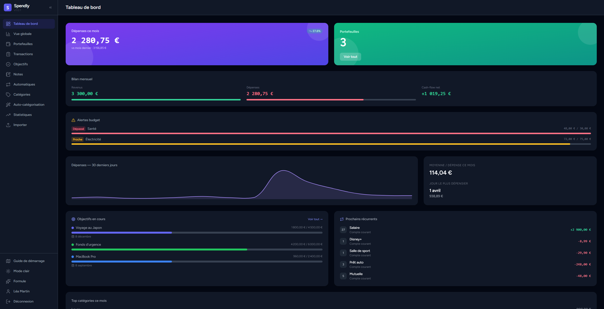
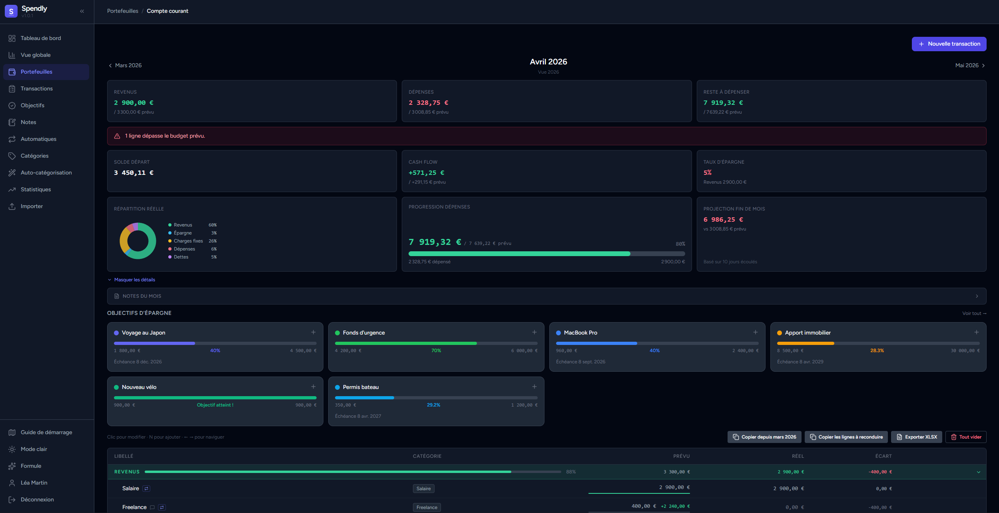
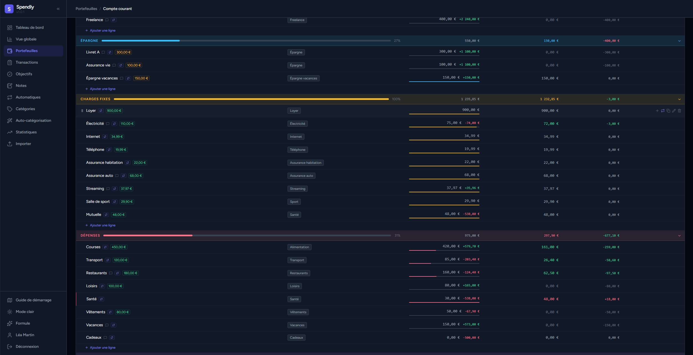
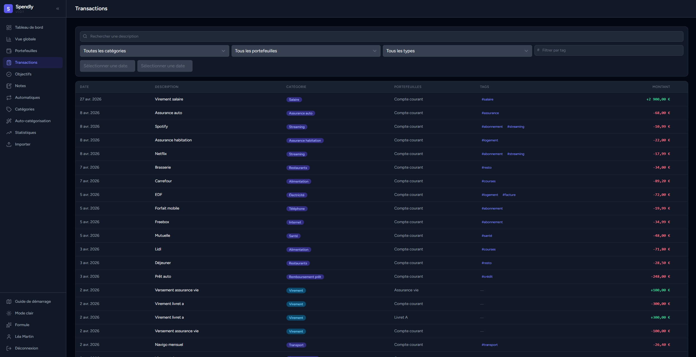
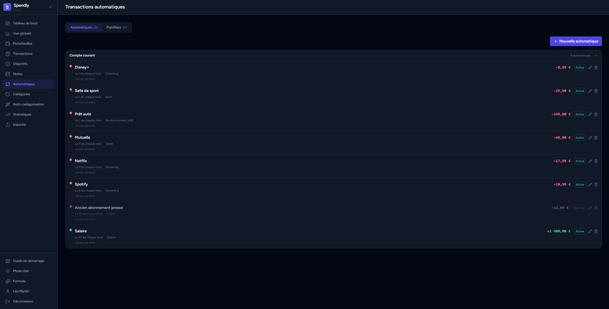
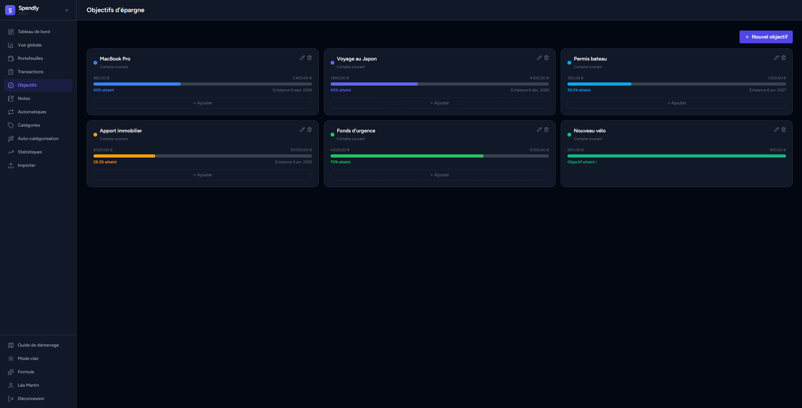
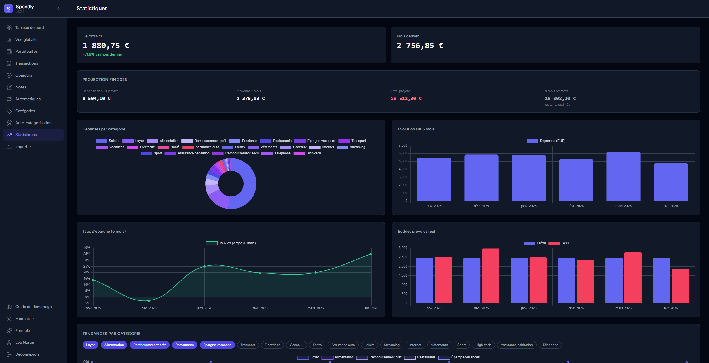
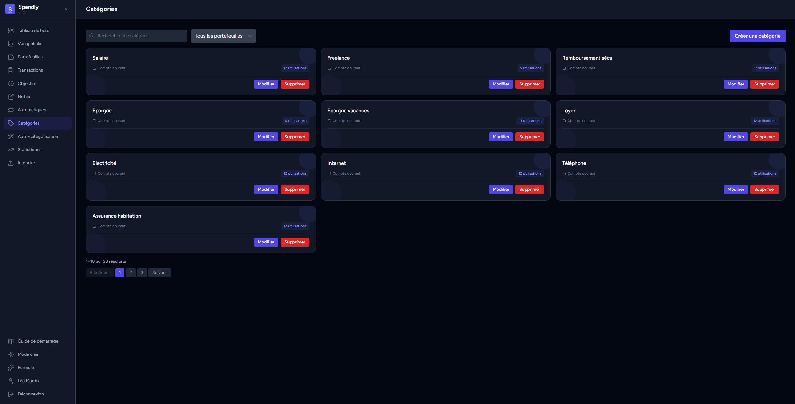
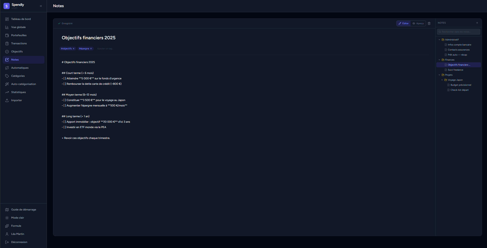

<div align="center">

# Spendly

**Application de gestion financiere personnelle**

[](https://laravel.com)
[](https://vuejs.org)
[](https://inertiajs.com)
[](https://tailwindcss.com)
[](https://php.net)

[**Visiter l'application**](https://spendly.axelraboit.fr) — spendly.axelraboit.fr

</div>

---

## Presentation

Spendly est une application web de gestion financiere personnelle qui vous permet de suivre vos depenses, gerer plusieurs portefeuilles, definir des objectifs d'epargne et analyser vos habitudes financieres mois par mois.

Concu avec une interface sombre moderne, Spendly centralise toutes vos finances en un seul endroit.

---

## Fonctionnalites

- **Tableau de bord** — Vue d'ensemble de vos finances du mois en cours : depenses, remboursements, evolution mensuelle, et derniere transaction enregistree
- **Vue globale** — Synthese multi-portefeuilles avec graphiques de revenus/depenses et repartition par categorie
- **Portefeuilles** — Gestion de plusieurs comptes independants (compte courant, livret, assurance vie…) avec suivi des objectifs budgetaires
- **Transactions** — Liste complete et filtrable de toutes vos transactions, organisees par categorie et par type (depense, revenu, virement)
- **Transactions automatiques** — Gestion des abonnements et transactions recurrentes (streaming, salle de sport, mutuelle…)
- **Objectifs d'epargne** — Suivi de la progression vers vos objectifs financiers avec indicateurs visuels
- **Statistiques** — Analyse graphique de vos habitudes de depenses sur la duree avec projections et evolution multi-mois
- **Categories** — Gestion personnalisee des categories de depenses et de revenus
- **Notes** — Prise de notes enrichie (Markdown) associee a vos finances
- **Export** — Export de vos donnees en Excel
- **Auto-configuration** — Parametrage personnalise des regles de gestion

---

## Apercu

### Tableau de bord



> Vue d'ensemble du mois : depenses totales, nombre de remboursements, evolution du budget, derniere transaction et top categories.

---

### Vue globale


> Synthese de tous vos portefeuilles avec graphiques de revenus/depenses par mois et donut de repartition par categorie.

---

### Portefeuille



> Detail d'un portefeuille : solde, objectifs en cours avec progression, et recapitulatif des transactions du mois.

---

### Transactions



> Detail des transactions d'un portefeuille, par categorie, avec types, montants et statuts.

---

### Liste des transactions



> Vue complete et filtrable de toutes les transactions (categorie, portefeuille, mois).

---

### Transactions automatiques



> Gestion des abonnements et paiements recurrents : streaming, sport, mutuelle, salaire…

---

### Objectifs d'epargne



> Suivi visuel de la progression vers chaque objectif financier (voyage, fonds d'urgence, immobilier…).

---

### Statistiques



> Tableaux de bord analytiques : depenses par categorie, evolution sur 6 mois, projections et budget cible.

---

### Categories



> Gestion des categories personnalisees avec sous-categories et types (depense / revenu).

---

### Notes



> Editeur de notes Markdown pour accompagner vos objectifs et reflexions financieres.

---

## Stack technique

| Couche | Technologie |
|--------|-------------|
| Backend | Laravel 13, PHP 8.4+ |
| Frontend | Vue.js 3, Inertia.js 3 |
| Style | Tailwind CSS 4 |
| Graphiques | Chart.js 4 + vue-chartjs |
| Auth & permissions | Laravel Sanctum, Spatie Permissions |
| Export | PhpSpreadsheet, xlsx-js-style |
| Emails | Resend |
| Build | Vite 8 |

---

## Installation

### Prerequis

- PHP >= 8.4
- Composer >= 2
- Node.js >= 20
- PostgreSQL

### Mise en place

```bash
# Cloner le depot
git clone https://github.com/AxelRaboit/spendly.git
cd spendly

# Installer toutes les dependances (composer + tools + pnpm)
make install

# Copier le fichier d'environnement et configurer
cp .env.example .env
php artisan key:generate
php artisan migrate
```

### Demarrage en developpement

**Demarrer le mailer (Mailpit via Docker) :**

```bash
docker compose up -d
```

**Lancer les serveurs de developpement :**

```bash
make dev
```

Lance en parallele : le serveur PHP, la queue, les logs Pail et Vite.

---

## Licence

MIT
